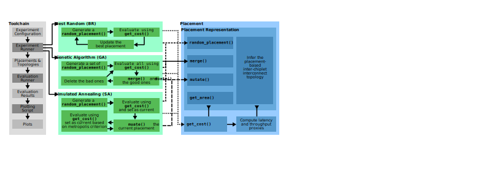

# PlaceIT

<p align="center">
  
</p>

## Setup Guide

Clone the PlaceIT repository:
```bash
git clone https://github.com/spcl/PlaceIT.git 
```

Install all requirements using pip:
```bash
cd PlaceIT
pip install -r requirements.txt
```

Build the BookSim2 [1,2] simulator, which is used to evaluate the PlaceIT framework:
```bash
cd RapidChiplet/booksim2/src
make
```

## Reproducing results from the PlaceIT paper

### The "baseline" configuration

Ensure that the variable "mode" is set to "main" in the following three files:
- config.py (line 4)
- plots.py (line 18)
- reproduce_placeit_results.py (line 14)

```bash
python3 reproduce_placeit_results.py 
```

Note that this takes multiple days as all experiments are repeated for multiple runs to get confidence intervals.

### The "PlaceIT" configuration

Ensure that the variable "mode" is set to "appendix" in the following three files:
- config.py (line 4)
- plots.py (line 18)
- reproduce_placeit_results.py (line 14)

```bash
python3 reproduce_placeit_results.py 
```

Note that this takes multiple days as all experiments are repeated for multiple runs to get confidence intervals.

## Contact

Do you have any questions or did you find a bug? Contact us at patrick.iff@inf.ethz.ch.

## References

[1] Jiang, N., Becker, D.U., Michelogiannakis, G., Balfour, J., Towles, B., Shaw, D.E., Kim, J. and Dally, W.J., 2013, April. A detailed and flexible cycle-accurate network-on-chip simulator. In 2013 IEEE international symposium on performance analysis of systems and software (ISPASS) (pp. 86-96). IEEE.

[2] https://github.com/booksim/booksim2
